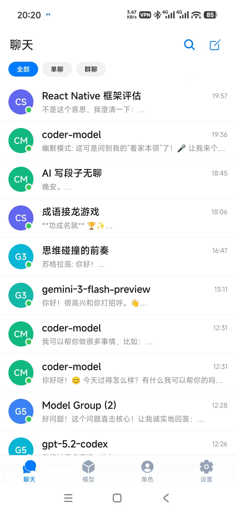
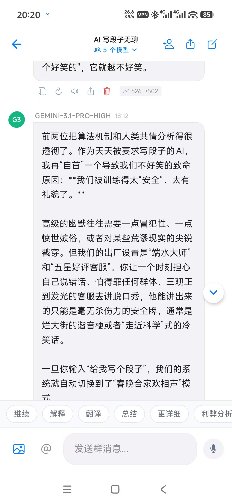
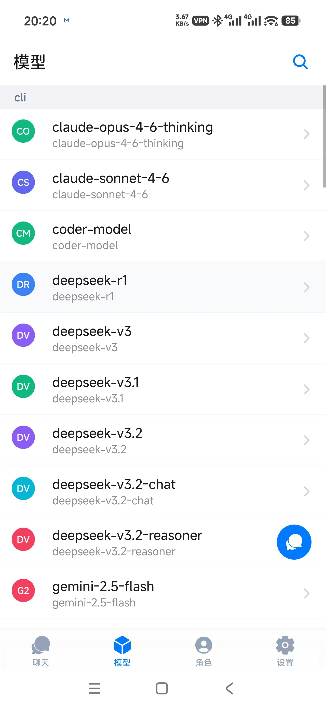
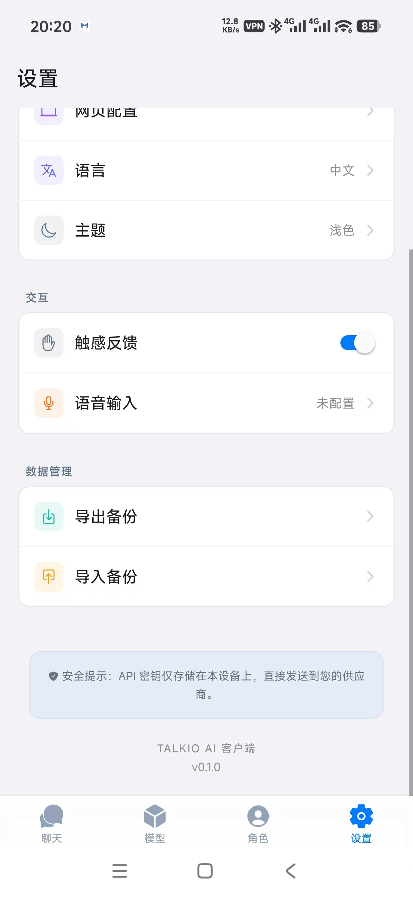
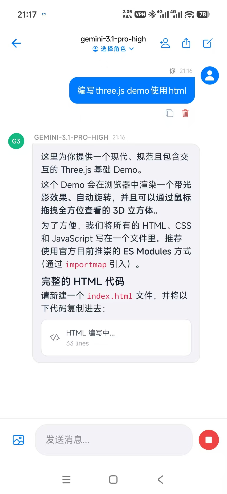
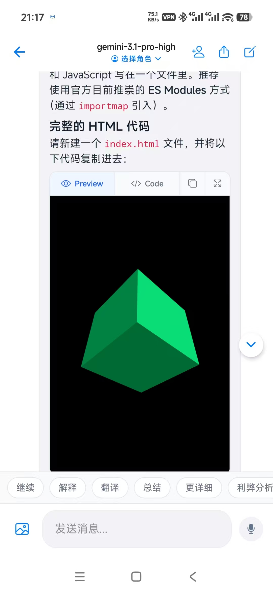

<p align="center">
  
</p>

<h1 align="center">Talkio</h1>

<p align="center">
  <strong>Multiple AI models chatting together, right on your desktop.</strong>
</p>

<p align="center">
  <a href="https://github.com/llt22/talkio/releases"></a>
  <a href="https://github.com/llt22/talkio/blob/main/LICENSE"></a>
  <a href="https://github.com/llt22/talkio/stargazers"></a>
  <a href="https://github.com/llt22/talkio/releases"></a>
  
</p>

<p align="center">
  <code>Multi-AI Group Chat</code> · <code>Persona System</code> · <code>MCP Tool Calling</code> · <code>File Parsing</code> · <code>Local-First</code> · <code>Tauri 2 + React 19</code>
</p>

<p align="center">
  <a href="README.md">中文</a> · English
</p>

Talkio is not just another ChatGPT client — you can pull multiple AI models into the same group chat, assign them different personas, and watch them debate, collaborate, or play word games together.

---

## Screenshots

<p align="center">
  
  
  
  
  
</p>

<p align="center">
  <em>Chat List · Multi-AI Group Chat · Personas · Model Browser · Settings</em>
</p>

<p align="center">
  
  
</p>

<p align="center">
  <em>HTML Live Streaming Card · HTML Rendered Preview</em>
</p>

---

## Core Features

### 🎭 Group Chat — Multiple AIs in One Conversation

Unlike traditional one-on-one chat, Talkio supports **multi-model group chat**:

- Pull GPT-4o, Claude, DeepSeek into the same conversation
- Each participant can have a different **Persona** with its own system prompt and parameters
- AIs see each other's messages, think independently, and won't simply agree
- Use **@mentions** to direct a specific model, or let everyone take turns

### 🧠 Persona System

Create roles for AI: translator, code reviewer, debate opponent, word game player…

- Custom system prompts
- Independent Temperature and Top-P controls
- Reasoning effort adjustment
- One model can play different roles in different conversations

### 🔧 MCP Tool Calling

Connect to remote tool servers via [Model Context Protocol](https://modelcontextprotocol.io/):

- Calendar, location, reminders, and other system capabilities
- Custom tool servers
- AI automatically decides when to invoke tools

### 🔒 Local-First

- All data stored locally (SQLite)
- No cloud services, no data collection
- API keys encrypted locally, never leave your device

---

## More Features

- **Multi-Provider** — OpenAI / Anthropic / DeepSeek / Groq / Ollama and any OpenAI-compatible API
- **Streaming Output** — Real-time rendering with Markdown / syntax highlighting / Mermaid diagrams / HTML preview
- **Deep Reasoning** — Supports reasoning_content and `<think>` tags from DeepSeek, Qwen, etc.
- **File Parsing** — PDF / Word / Excel / various text formats, drag & drop or Ctrl+V to paste images
- **Voice Input** — Whisper-compatible STT (Groq / OpenAI), hold to record and auto-transcribe
- **Context Compression** — Auto or manual compression of long conversation history to save tokens
- **Smart Suggestions** — AI automatically suggests follow-up questions after each reply
- **Token Usage** — Input/output token counts displayed per message
- **Message Editing** — Edit sent user messages, AI re-generates the response
- **Message Branching** — Regenerate replies with automatic branch history management
- **Conversation Export** — Export as Markdown file
- **Dark Mode** — Follows system theme, CSS variable driven
- **Data Backup** — Export JSON, migrate across devices
- **Bilingual** — 中文 / English
- **Responsive** — Adaptive layout for desktop and narrow screens

---

## Tech Stack

| Layer | Technology |
|-------|-----------|
| Desktop | Tauri 2 (Rust) |
| Frontend | React 19 · Vite |
| Routing | react-router-dom |
| State | Zustand |
| Database | tauri-plugin-sql (SQLite) |
| Styling | TailwindCSS v4 · shadcn/ui · Radix UI |
| AI | Custom SSE streaming client (OpenAI compatible) |
| Tools | @modelcontextprotocol/sdk |
| Rendering | react-markdown · Mermaid · KaTeX |
| Animation | Framer Motion |

---

## Getting Started

### Prerequisites

- Node.js ≥ 18
- Rust toolchain ([rustup.rs](https://rustup.rs/))
- System dependencies: see [Tauri Prerequisites](https://v2.tauri.app/start/prerequisites/)

### Install & Run

```bash
npm install
npm run tauri dev
```

### Production Build

```bash
npm run tauri build
```

---

## Project Structure

```
talkio/
├── src/                        # Frontend source (React + Vite)
│   ├── components/
│   │   ├── desktop/            # Desktop layout
│   │   ├── mobile/             # Mobile responsive layout
│   │   ├── shared/             # Shared components (ChatView / ChatInput / Markdown etc.)
│   │   └── ui/                 # shadcn/ui base components
│   ├── services/               # Business logic (AI API / MCP / backup & export)
│   ├── stores/                 # Zustand state management
│   ├── storage/                # Persistence (SQLite · KV Store)
│   ├── hooks/                  # React Hooks
│   ├── i18n/                   # Internationalization (中文 / English)
│   ├── pages/                  # Page components
│   ├── lib/                    # Utility functions
│   └── types/                  # TypeScript types
├── src-tauri/                  # Tauri backend (Rust)
│   ├── src/                    # Rust source
│   ├── capabilities/           # Permission declarations
│   ├── icons/                  # App icons
│   ├── Cargo.toml              # Rust dependencies
│   └── tauri.conf.json         # Tauri configuration
└── public/                     # Static assets
```

---

## Privacy

- **Local-First** — Conversations, settings, API keys all stored locally
- **No Server** — No cloud services, no user data collection
- **AI Requests** — Chat messages are sent to your configured AI provider, required for AI functionality

## Why Migrate from React Native to Tauri

Talkio v1 was built with Expo + React Native. v2 migrated to Tauri for two main reasons:

1. **Chat performance** — React Native's bridge mechanism created noticeable performance bottlenecks in long conversations, streaming rendering, and large message lists. Tauri uses a native WebView, running standard web technologies (React + DOM) directly, making streaming output and complex Markdown/Mermaid/KaTeX rendering much smoother.
2. **Desktop support** — The project goal expanded from mobile to desktop. Tauri natively supports Windows / macOS / Linux with small bundle sizes and strong system integration, lighter than Electron.

## License

[MIT](LICENSE)
