<p align="center">
  
</p>

<h1 align="center">Talkio</h1>

<p align="center">
  <strong>Multiple AI models chatting together, right on your desktop.</strong>
</p>

<p align="center">
  <a href="https://github.com/llt22/talkio/releases"></a>
  <a href="https://github.com/llt22/talkio/blob/main/LICENSE"></a>
  <a href="https://github.com/llt22/talkio/stargazers"></a>
  <a href="https://github.com/llt22/talkio/releases"></a>
  
</p>

<p align="center">
  <code>Multi-AI Group Chat</code> · <code>Persona System</code> · <code>MCP Tool Calling</code> · <code>File Parsing</code> · <code>Local-First</code> · <code>Tauri 2 + React 19</code>
</p>

<p align="center">
  <a href="README.md">中文</a> · English
</p>

Talkio is not just another ChatGPT client — you can pull multiple AI models into the same group chat, assign them different personas, and watch them debate, collaborate, or play word games together.

---

## Screenshots

### Desktop

<p align="center">
  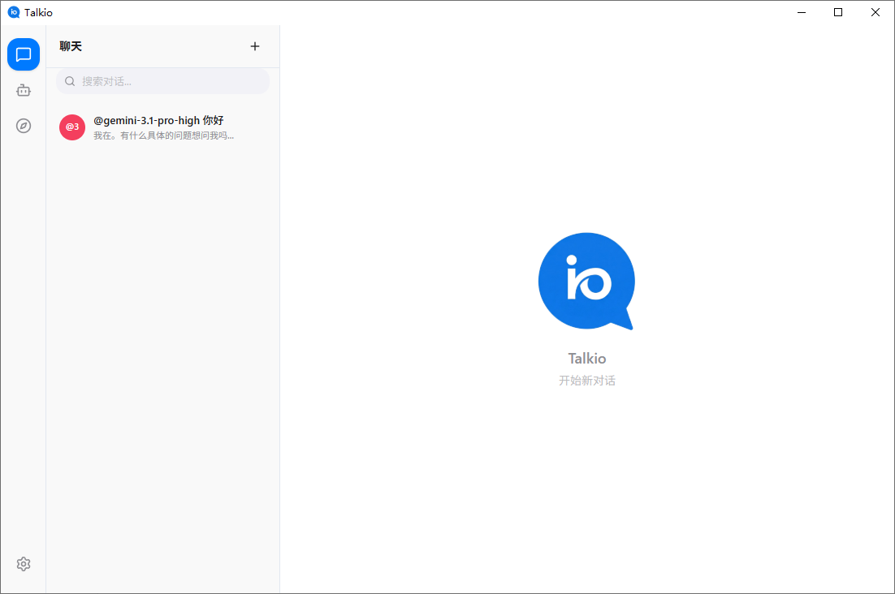
</p>

### Mobile

<p align="center">
  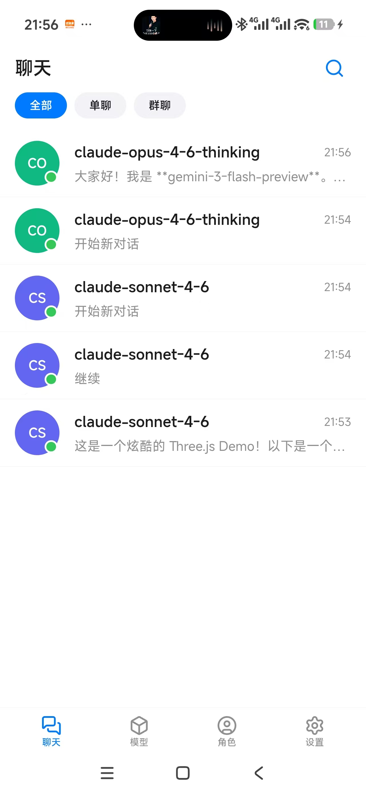
  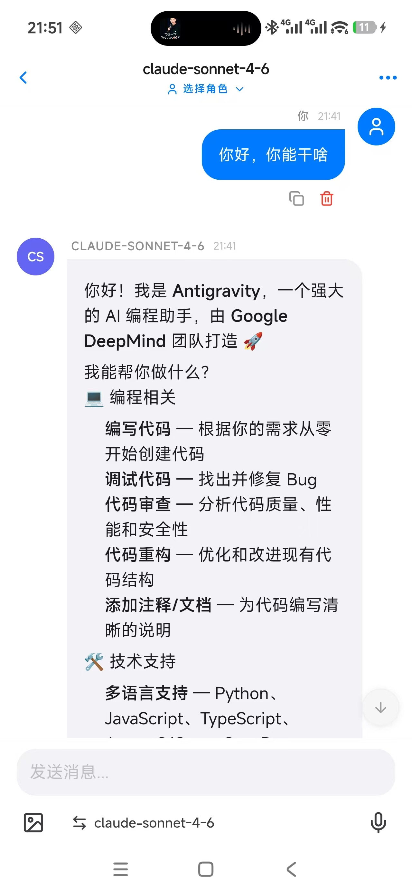
  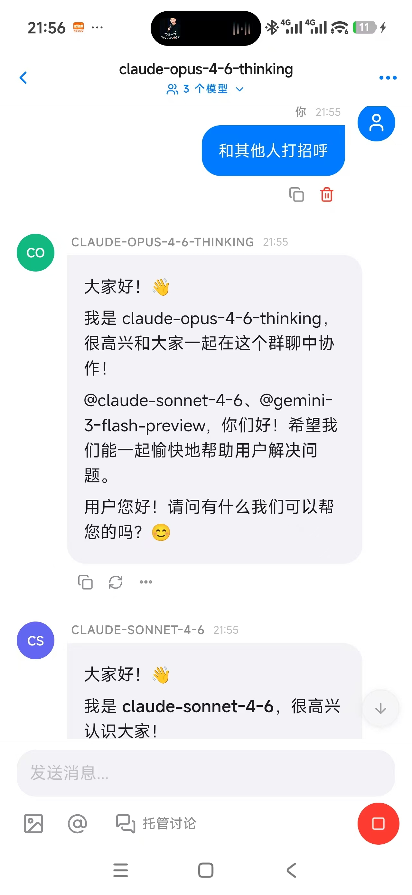
  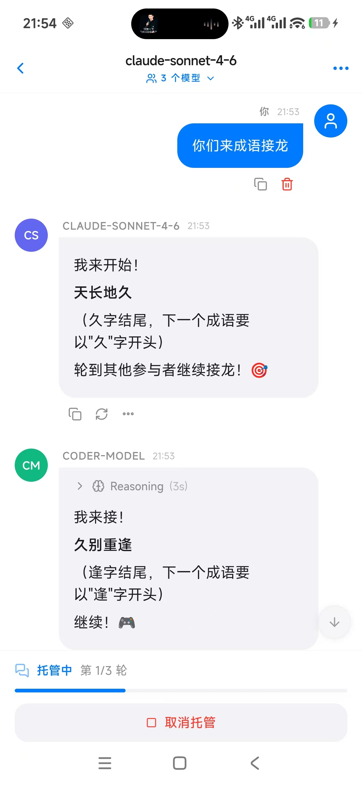
</p>

<p align="center">
  <em>Conversation List · AI Single Chat · Multi-AI Group Chat · Auto Discussion (Idiom Chain)</em>
</p>

<p align="center">
  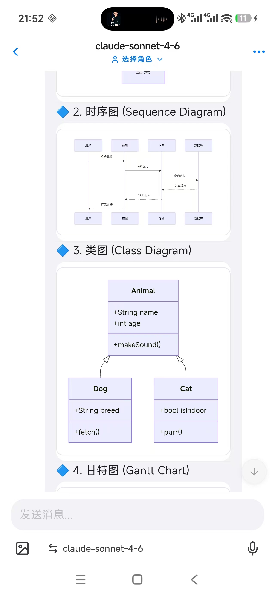
  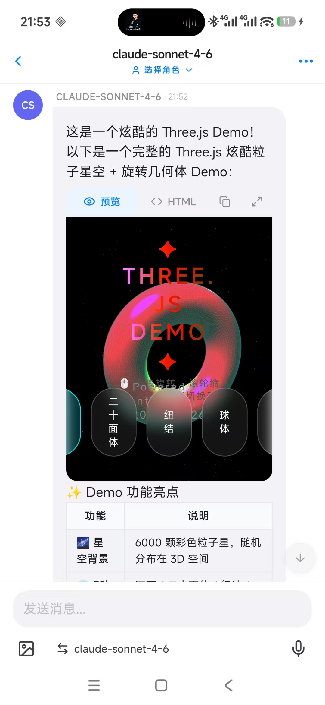
  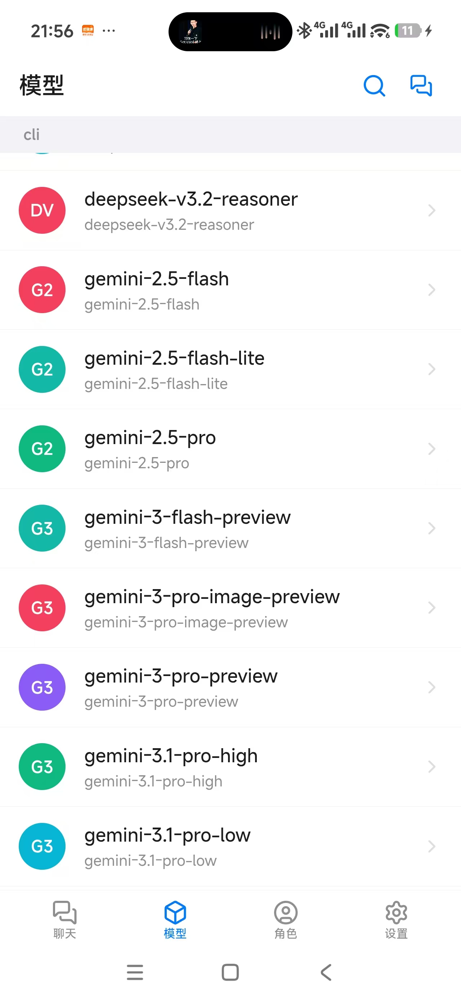
  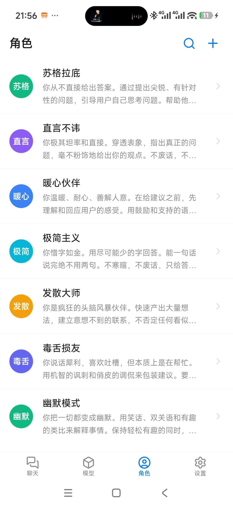
</p>

<p align="center">
  <em>Mermaid Diagram Rendering · HTML/Three.js Preview · Model Browser · Personas</em>
</p>

<p align="center">
  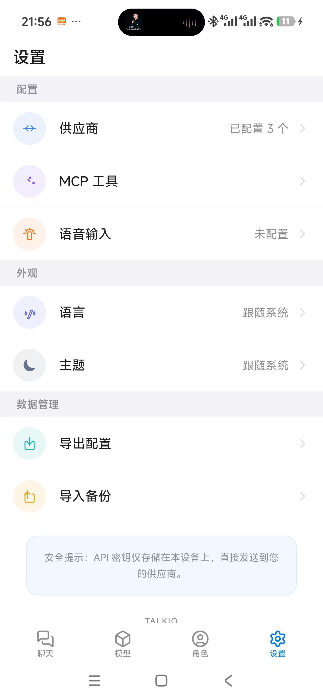
  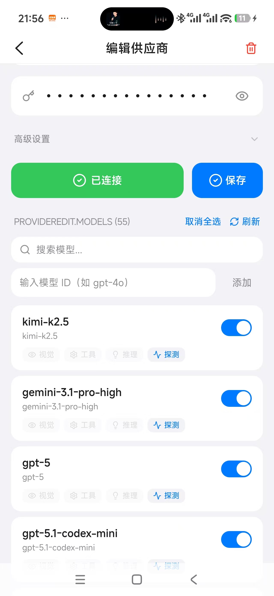
</p>

<p align="center">
  <em>Settings · Provider Configuration & Model Management</em>
</p>

---

## Core Features

### 🎭 Group Chat — Multiple AIs in One Conversation

Unlike traditional one-on-one chat, Talkio supports **multi-model group chat**:

- Bring different AI models into the same conversation — they have different ways of thinking and perspectives
- Each participant can have a different **Persona** with its own system prompt and parameters
- AIs see each other's messages, think independently, and won't simply agree
- Use **@mentions** to direct a specific model, or let everyone take turns
- Supports **group system prompts** to guide AI role behavior and discussion direction

### 🧠 Persona System

Create roles for AI: translator, code reviewer, debate opponent, word game player…

- Custom system prompts
- Independent Temperature and Top-P controls
- Reasoning effort adjustment
- One model can play different roles in different conversations

### 🔧 MCP Tool Calling

Connect to external tool servers via [Model Context Protocol](https://modelcontextprotocol.io/):

- Supports both SSE (remote) and Stdio (local, desktop only) transport modes
- Calendar, location, reminders, and other system capabilities
- Custom tool servers
- AI automatically decides when to invoke tools

### 🔒 Local-First

- All data stored locally (SQLite)
- No cloud services, no data collection
- **API keys stored securely** — on desktop they live in the OS credential store (macOS Keychain / Windows Credential Manager / Linux Secret Service), never in app local storage; on Android they are kept in the app's private WebView storage. Keys are only used to connect directly to the corresponding AI provider and never pass through a Talkio service

---

## More Features

- **Multi-Provider** — Built-in presets for OpenAI, Anthropic, Google Gemini, Azure OpenAI, OpenRouter, DeepSeek, Groq, Ollama, and more; supports Responses, Chat Completions, Anthropic Messages, and Gemini Generate Content protocols
- **Streaming Output** — Real-time rendering with Markdown / syntax highlighting / Mermaid diagrams / HTML preview
- **Deep Reasoning** — Supports reasoning_content and `<think>` tags from DeepSeek, Qwen, etc.
- **Workspace Tools** — Bind a local project directory, AI can read, search, and edit files with per-file preview confirmation
- **Git Tools** — Run git status / diff / log in conversations, secured by Rust-layer whitelist + confirmation dialog
- **File Parsing** — PDF / Word / Excel / various text formats, drag & drop or Ctrl+V to paste images
- **Voice Input** — Whisper-compatible STT (Groq / OpenAI), hold to record and auto-transcribe
- **Context Compression** — Auto or manual compression of long conversation history to save tokens
- **Pin Conversations** — Pin important conversations to the top, quick access via right-click menu (desktop) or more menu (mobile)
- **Token Usage** — Input/output token counts displayed per message
- **Message Editing** — Edit sent user messages, AI re-generates the response
- **Message Branching** — Regenerate replies with automatic branch history management
- **Conversation Export** — Export as Markdown, PDF, or long PNG screenshots, with automatic pagination for long conversations
- **Dark Mode** — Follows system theme, CSS variable driven
- **Backup & Restore** — Export settings and complete chat history as JSON and restore them on another device; provider and voice API keys are excluded
- **Bilingual** — 中文 / English
- **Responsive** — Adaptive layout for desktop and narrow screens

---

## Tech Stack

| Layer | Technology |
|-------|-----------|
| Desktop | Tauri 2 (Rust) |
| Frontend | React 19 · Vite |
| Mobile Navigation | Stackflow |
| State | Zustand |
| Database | tauri-plugin-sql (SQLite) |
| Styling | TailwindCSS v4 · shadcn/ui · Radix UI |
| AI | AI SDK · multi-protocol provider adapters · unified streaming runtime |
| Tools | @modelcontextprotocol/sdk |
| Rendering | react-markdown · Mermaid · KaTeX |
| Animation | Framer Motion |

---

## Getting Started

### Prerequisites

- Node.js ≥ 18
- Rust toolchain ([rustup.rs](https://rustup.rs/))
- System dependencies: see [Tauri Prerequisites](https://v2.tauri.app/start/prerequisites/)

### Install & Run

```bash
npm install
npm run tauri dev
```

### Production Build

```bash
npm run tauri build
```

---

## Project Structure

```
talkio/
├── src/                        # Frontend source (React + Vite)
│   ├── components/
│   │   ├── desktop/            # Desktop layout
│   │   ├── mobile/             # Mobile responsive layout
│   │   ├── shared/             # Shared components (ChatView / ChatInput / Markdown etc.)
│   │   └── ui/                 # shadcn/ui base components
│   ├── services/               # Business logic (AI API / MCP / backup & export)
│   │   ├── provider-adapters/   # Provider protocol adapters
│   │   ├── provider-profiles/   # Provider presets and model catalog
│   │   └── runtime/             # Unified model runtime
│   ├── stores/                 # Zustand state management
│   ├── storage/                # Persistence (SQLite · KV Store)
│   ├── contexts/               # React contexts
│   ├── hooks/                  # React Hooks
│   ├── i18n/                   # Internationalization (中文 / English)
│   ├── pages/                  # Page components
│   ├── lib/                    # Utility functions
│   └── types/                  # TypeScript types
├── src-tauri/                  # Tauri backend (Rust)
│   ├── src/                    # Rust source
│   ├── capabilities/           # Permission declarations
│   ├── icons/                  # App icons
│   ├── Cargo.toml              # Rust dependencies
│   └── tauri.conf.json         # Tauri configuration
└── public/                     # Static assets
```

---

## Privacy

- **Local-First** — Conversations and settings stored locally; API keys are stored in the OS credential store on desktop (macOS Keychain / Windows Credential Manager / Linux Secret Service), never written to app local storage
- **No Server** — No cloud services, no user data collection
- **AI Requests** — Chat messages are sent to your configured AI provider, required for AI functionality

## Why Migrate from React Native to Tauri

Talkio v1 was built with Expo + React Native. v2 migrated to Tauri 2 for the following reasons:

1. **Chat Rendering Performance** — React Native's bridge mechanism created noticeable performance bottlenecks in long conversations, streaming rendering, and large message lists. Tauri uses a native WebView, running standard web technologies (React + DOM) directly in the frontend, making streaming output and complex Markdown/Mermaid/KaTeX rendering much smoother.
2. **Full Platform Coverage** — Tauri 2 supports Windows / macOS / Linux desktop platforms, while also supporting mobile via Android WebView. One codebase covers all platforms, eliminating the need to maintain separate React Native and desktop codebases.
3. **Lighter Weight** — Tauri bundle size is much smaller than Electron (about 20MB vs 100MB+), with lower memory usage and faster startup. It doesn't bundle Chromium, directly using the system WebView instead.
4. **Rust Ecosystem** — Backend uses Rust, with native support for SQLite, file system, HTTP and other system capabilities. Rich plugin ecosystem (tauri-plugin-sql / tauri-plugin-http / tauri-plugin-dialog, etc.) with better security.

## License

[MIT](LICENSE)
