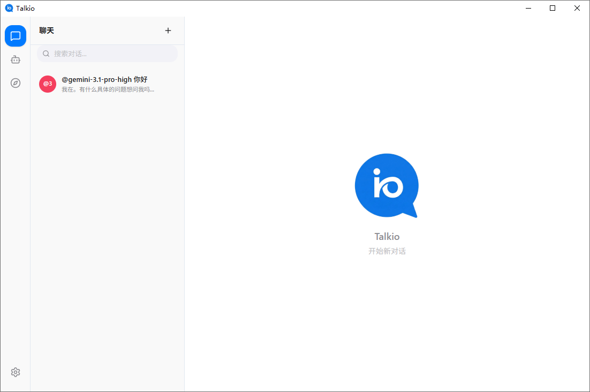
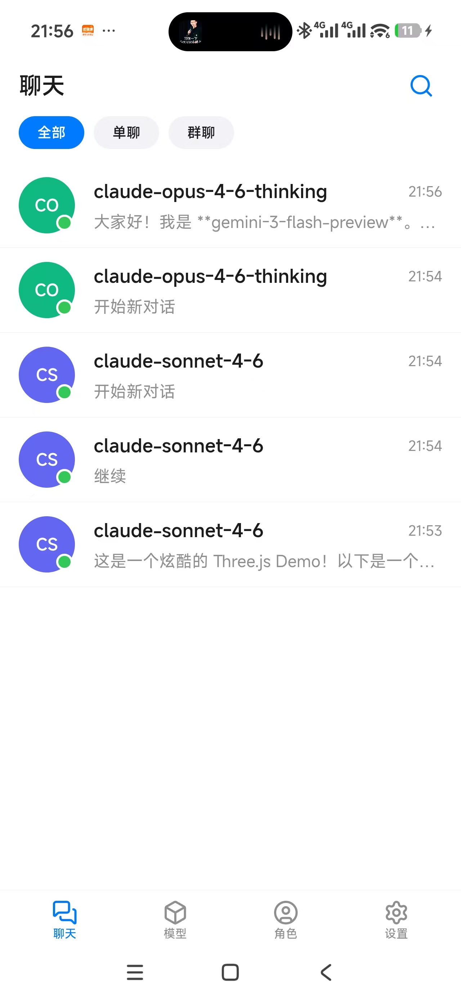
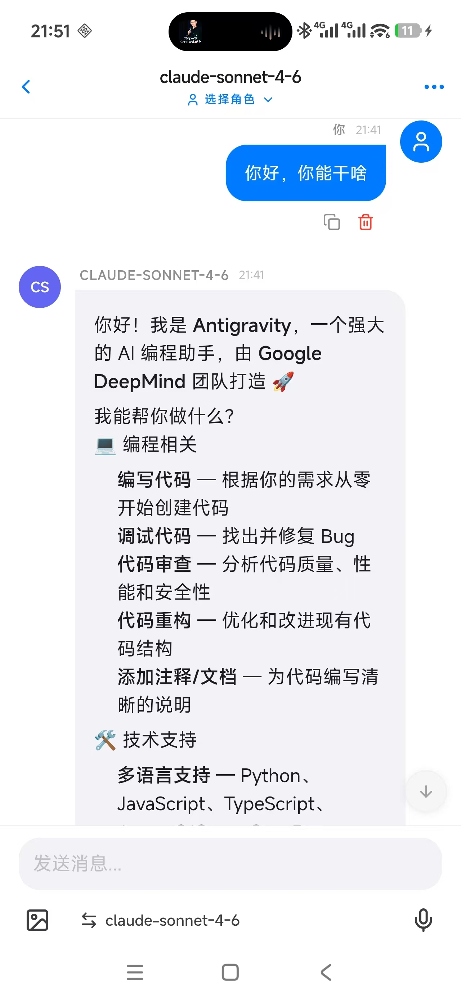
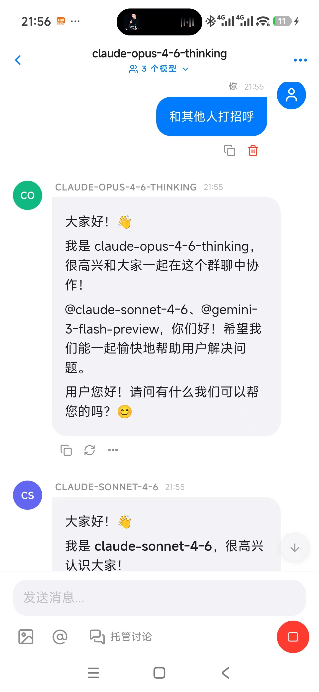
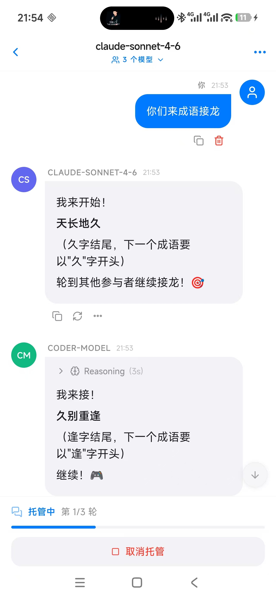
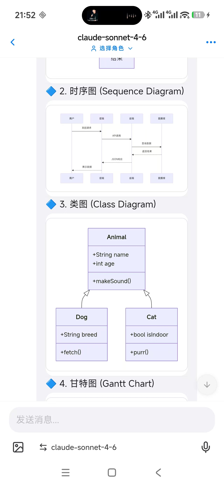
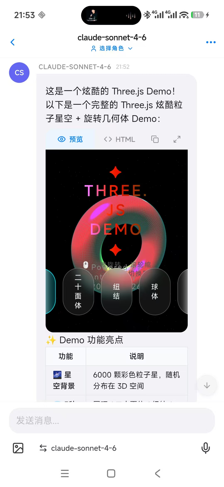
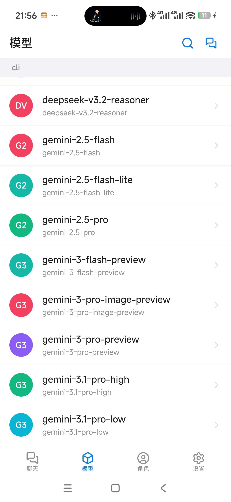
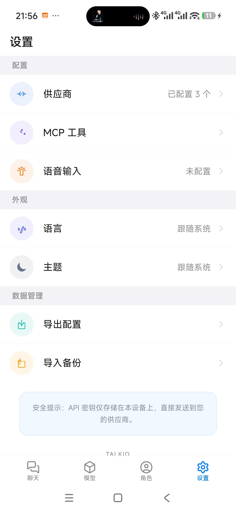
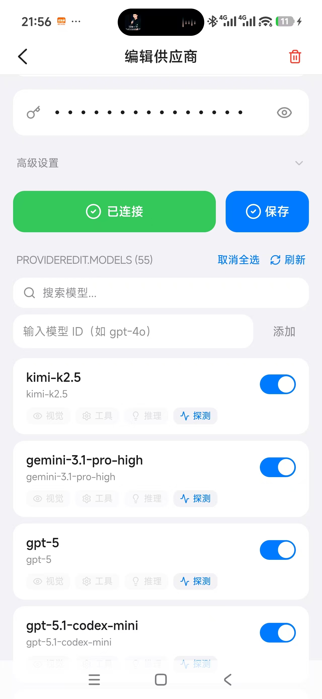

<p align="center">
  
</p>

<h1 align="center">Talkio</h1>

<p align="center">
  <strong>让多个 AI 在你的桌面上同时对话。</strong>
</p>

<p align="center">
  <a href="https://github.com/llt22/talkio/releases"></a>
  <a href="https://github.com/llt22/talkio/blob/main/LICENSE"></a>
  <a href="https://github.com/llt22/talkio/stargazers"></a>
  <a href="https://github.com/llt22/talkio/releases"></a>
  
</p>

<p align="center">
  <code>多模型群聊</code> · <code>身份角色系统</code> · <code>MCP 工具调用</code> · <code>本地优先</code> · <code>Tauri 2 + React 19</code>
</p>

<p align="center">
  中文 · <a href="README-en.md">English</a>
</p>

Talkio 不只是又一个 ChatGPT 客户端——你可以把多个 AI 模型拉进同一个群聊，让它们各自扮演不同角色，围绕同一个话题展开讨论、辩论、接龙。

---

## 截图

### 桌面端

<p align="center">
  
</p>

### 移动端

<p align="center">
  
  
  
  
</p>

<p align="center">
  <em>对话列表 · AI 单聊 · 多模型群聊 · 托管讨论（成语接龙）</em>
</p>

<p align="center">
  
  
  
  
</p>

<p align="center">
  <em>Mermaid 图表渲染 · HTML/Three.js 预览 · 模型浏览 · 身份角色</em>
</p>

<p align="center">
  
  
</p>

<p align="center">
  <em>设置 · 供应商配置与模型管理</em>
</p>

---

## 核心特色

### 🎭 群聊 — 多 AI 同时对话

不同于传统的一对一聊天，Talkio 支持**多模型群聊**：

- 把 GPT-4o、Claude、DeepSeek 拉进同一个对话
- 每个参与者可以绑定不同的**身份（Persona）**，拥有独立的系统提示词和参数
- AI 之间能看到彼此的发言，独立思考，不会简单附和
- 用 **@提及** 指定某个模型回答，或让所有人轮流发言

### 🧠 身份系统

为 AI 创建角色：翻译官、代码审查员、辩论对手、成语接龙玩家……

- 自定义系统提示词
- 独立调节温度（Temperature）和 Top-P
- 推理力度控制（Reasoning Effort）
- 一个模型可以在不同对话中扮演不同角色

### 🔧 MCP 工具调用

通过 [Model Context Protocol](https://modelcontextprotocol.io/) 连接远程工具服务器：

- 日历、位置、提醒等系统能力
- 自定义工具服务器
- AI 自动决定何时调用工具

### 🔒 本地优先

- 所有数据存储在本地（SQLite）
- 不运行任何云端服务，不收集用户数据
- API Key 加密存储，永远不离开你的设备

---

## 更多功能

- **多 Provider** — OpenAI / Anthropic / DeepSeek / Groq / Ollama 等任何 OpenAI 兼容 API
- **流式输出** — 实时渲染，支持 Markdown / 代码高亮 / Mermaid 图表 / HTML 预览
- **深度推理** — 支持 DeepSeek、Qwen 等模型的 reasoning_content 和 `<think>` 标签
- **消息分支** — 重新生成回复，自动管理分支历史
- **暗色模式** — 跟随系统主题，CSS 变量驱动
- **数据备份** — 导出 JSON，跨设备迁移
- **双语** — 中文 / English
- **响应式** — 桌面 / 窄屏自适应布局

---

## 技术栈

| 层级 | 技术 |
|------|------|
| 桌面框架 | Tauri 2 (Rust) |
| 前端框架 | React 19 · Vite |
| 路由 | react-router-dom |
| 状态管理 | Zustand |
| 数据库 | tauri-plugin-sql (SQLite) |
| 样式 | TailwindCSS v4 · shadcn/ui · Radix UI |
| AI | 自定义 SSE 流式客户端（OpenAI 兼容） |
| 工具协议 | @modelcontextprotocol/sdk |
| 渲染 | react-markdown · Mermaid · KaTeX |
| 动画 | Framer Motion |

---

## 快速开始

### 前置条件

- Node.js ≥ 18
- Rust 工具链（[rustup.rs](https://rustup.rs/)）
- 系统依赖：参考 [Tauri 环境搭建指南](https://v2.tauri.app/start/prerequisites/)

### 安装与运行

```bash
npm install
npm run tauri dev
```

### 生产构建

```bash
npm run tauri build
```

---

## 项目结构

```
talkio/
├── src/                        # 前端源码（React + Vite）
│   ├── components/
│   │   ├── desktop/            # 桌面端布局
│   │   ├── mobile/             # 移动端响应式布局
│   │   ├── shared/             # 共享组件（ChatView / ChatInput / Markdown 等）
│   │   └── ui/                 # shadcn/ui 基础组件
│   ├── services/               # 业务逻辑（AI API / MCP / 备份导出）
│   ├── stores/                 # Zustand 状态管理
│   ├── storage/                # 持久化（SQLite · KV Store）
│   ├── hooks/                  # React Hooks
│   ├── i18n/                   # 国际化（中文 / English）
│   ├── pages/                  # 页面组件
│   ├── lib/                    # 工具函数
│   └── types/                  # TypeScript 类型
├── src-tauri/                  # Tauri 后端（Rust）
│   ├── src/                    # Rust 源码
│   ├── capabilities/           # 权限声明
│   ├── icons/                  # 应用图标
│   ├── Cargo.toml              # Rust 依赖
│   └── tauri.conf.json         # Tauri 配置
└── public/                     # 静态资源
```

---

## 隐私

- **本地优先** — 对话、设置、API Key 全部存储在本地
- **无服务器** — 不运行云端服务，不收集任何用户数据
- **AI 请求** — 聊天消息发送到你配置的 AI Provider，这是 AI 功能运行的必要条件

## 为什么从 React Native 迁移到 Tauri

Talkio v1 基于 Expo + React Native 构建。v2 迁移到 Tauri 2，原因如下：

1. **聊天渲染性能** — React Native 的桥接机制在长对话、流式渲染、大量消息列表场景下存在明显性能瓶颈。Tauri 使用原生 WebView，前端直接运行标准 Web 技术栈（React + DOM），流式输出和复杂 Markdown / Mermaid / KaTeX 渲染更加流畅。
2. **全平台覆盖** — Tauri 2 支持 Windows / macOS / Linux 桌面端，同时通过 Android WebView 支持移动端。一套代码覆盖全平台，无需维护 React Native 和桌面端两套代码。
3. **更轻量** — Tauri 打包体积远小于 Electron（约 20MB vs 100MB+），内存占用更低，启动更快。不捆绑 Chromium，直接使用系统 WebView。
4. **Rust 生态** — 后端使用 Rust，原生支持 SQLite、文件系统、HTTP 等系统能力，插件生态完善（tauri-plugin-sql / tauri-plugin-http / tauri-plugin-dialog 等），安全性更高。

## 许可证

[MIT](LICENSE)
